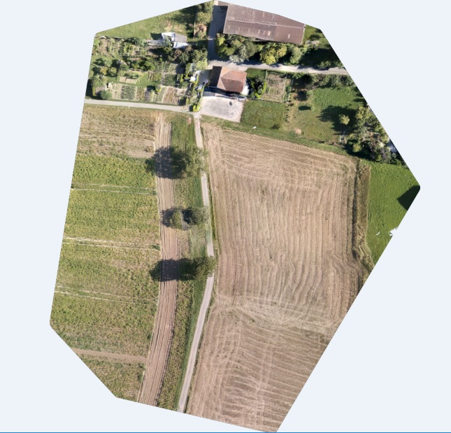
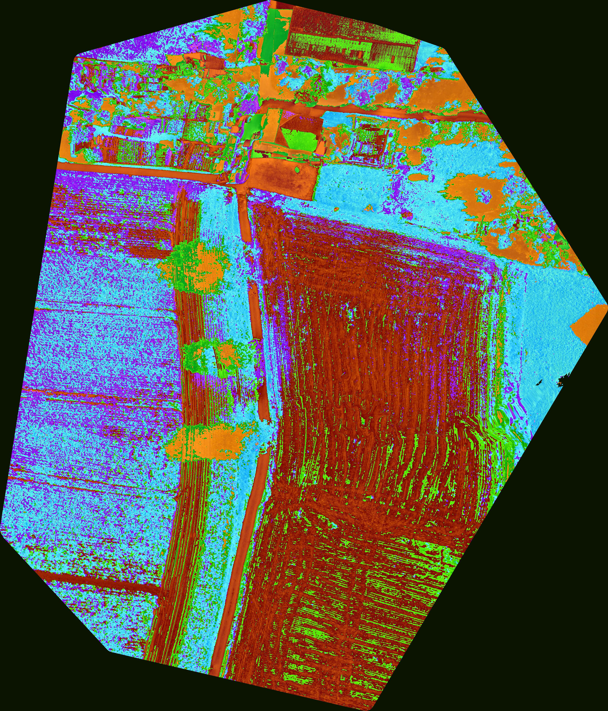
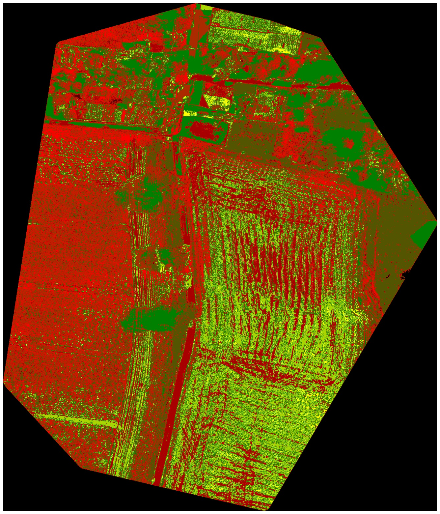
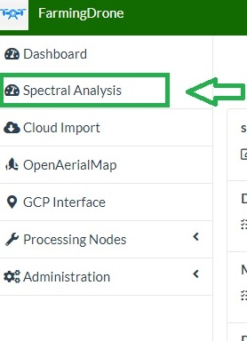
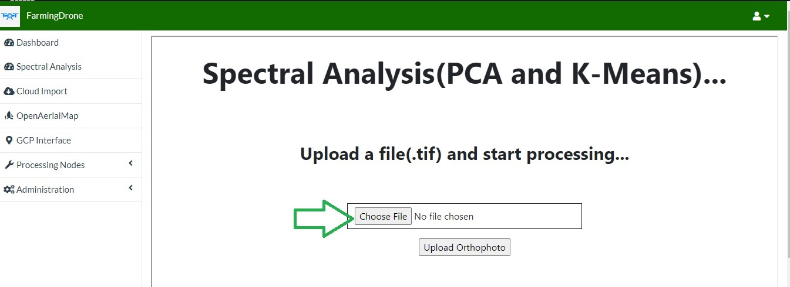
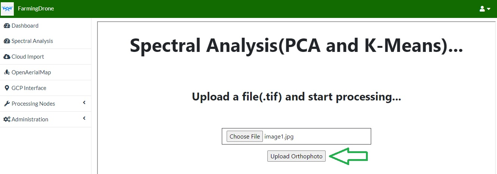
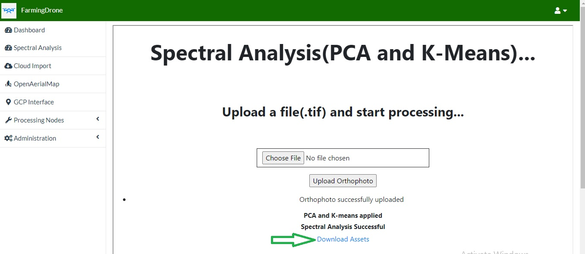
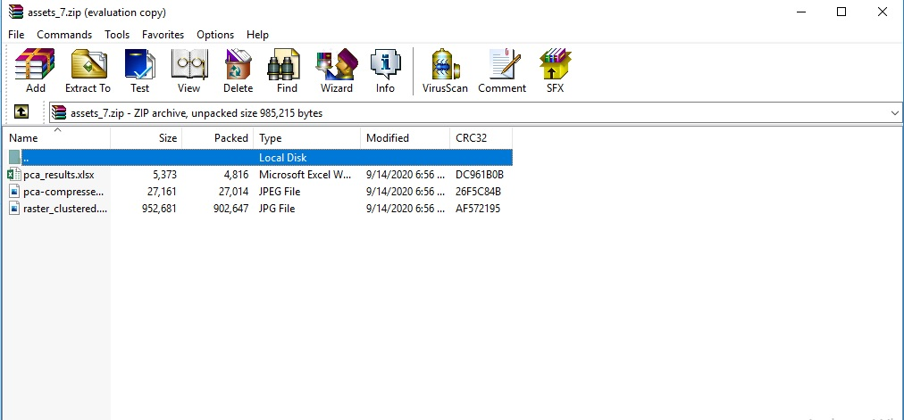

# Spectral-Analysis-WebODM

#### The above code is the implementation of *Principle Component Analysis(PCA)* and *K-means* clustering of the image for spectral Analysis.

## Methodology:

### PCA
#### The GDAL library  is used to read the orthophoto(tif). Once the orthopoto is read by GDAL. It is converted into an array with the help of gdal_array function to read the image as an array. One we have the array of orthophoto, PCA is implemented on the image array. To implement PCA spectral library is used. principle_components(image_array) is implemented to determine the PCA components and compress the image. 

#### Original Orthophoto(tif)

#### Compressed Image(After PCA)

#### *The compressed image as well as details of pca can be downloaded after the processing.*

### K-Means
#### For the K-means clustering of the image rasterio library is used. K means is implemented with 10 clusters(k=10). Image is opened with rasterio. Empty array is created and filled with the raster band of the image. Then the array is converted into 1d vectors. Finally the k-means algorithm is implemented on the 1-d array and colors are segmented to get the clustered image.

#### Raster Clustered Image with k=10

#### *The clustered image as well as details of pca can be downloaded after the processing.*

### Flask Application
#### Flask is used to create the web application for using the implemented algoriths in the picture. Web page is created where Normal image or orthophoto can be uploaded and processed with the PCA and K-means algorithms and the results can be downloaded.

### The codebase consists of following files:

#### *k_means.py*: K-Means Implementation
#### *pca.py*: PCA Implementation
#### *main.py*: Flask Web Application of using implemented algorithms
#### *index.html*: Web Page for Web Appication

### Web ODM
#### The web application is hosted in the server and its *iframe* is integrated in Web ODM interface.

### Following updates are made in WebODM framework:
#### New view named (spectral_analysis) is created where the template containing iframe for flask web app is rendered. Web ODM file/directory: *app/views/app.py*
#### URL for the rendered webpage is added on *app/urls.py*
#### Side Navigation Menu *Spectral Analysis* is added on the base template *app/template/app/logged_in_based.html*.
#### New web page is created on *app/template/app/spectral-analysis.html* which is rendered by above view and is linked to the Side Navigatin Menu mentioned above where iframe of the flask web app is implemented.

### Implementation

#### The above algorithms are implemented in the WebODM interface.

 

